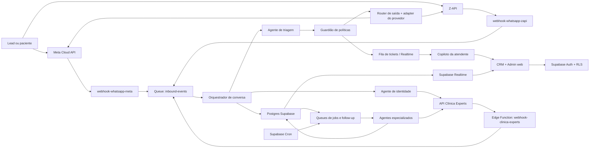

# Escopo definitivo — Plataforma Comercial Inteligente da PS Estética

**Versão:** 3.1 — 29/09/2026 (endpoints da API Clínica Experts verificados ao vivo; ver seção 12)
**Projeto:** CRM conversacional, automações comerciais e agentes de IA
**Frontend:** aplicação web responsiva, preparada para desktop e celular
**Backend e banco de dados:** Supabase
**Sistema externo principal:** Clínica Experts
**Canal inicial:** WhatsApp oficial (Meta Cloud API) e não oficial (Z-API)
**Empresa atendida:** PS Estética; “F3 Energy Drink” é apenas referência cadastral legada
**Horizonte de execução:** quatro meses, organizado em exatamente cinco fases incrementais

## 1. Resultado de negócio

Construir uma operação comercial multi-clínica para a PS Estética, iniciando com as duas clínicas atuais e preparada para cadastrar a terceira e as seguintes sem alterar código. A plataforma deverá receber conversas dos números próprios de cada clínica, identificar se o contato já é paciente, registrar e acompanhar novos leads, entregar o caso à fila e à atendente daquela clínica, controlar follow-ups, recuperar oportunidades e dar ao gestor uma visão confiável da rotina comercial.

O sistema deverá reduzir quatro perdas principais:

1. Mensagens sem resposta ou sem responsável.
2. Leads que não avançam por falta de próxima ação.
3. Clientes que fazem avaliação, não fecham e não entram em recuperação rapidamente.
4. Falta de dados confiáveis sobre atendimento, conversão, comparecimento, fechamento e recompra.

### Resultados mensuráveis

- 100% das mensagens elegíveis recebidas pelo conector deverão gerar registro idempotente de evento, conversa e status de processamento.
- 100% das conversas em atendimento deverão ter clínica, contato, responsável ou fila e próxima ação explícitos.
- 100% dos transbordos deverão registrar motivo, origem, horário, prioridade e responsável.
- 100% das chamadas externas deverão ter correlação, status, duração e erro sanitizado.
- O sistema deverá produzir baseline de tempo de primeira resposta, lead para agendamento, comparecimento, fechamento, recuperação e recompra.
- Metas percentuais de melhoria serão aprovadas após 30 dias de baseline confiável; não serão inventadas no escopo.

## 2. Decisões estruturais confirmadas

| ID | Decisão | Consequência no projeto |
|---|---|---|
| DEC-01 | Usar Supabase como backend e banco | Postgres, Auth, RLS, Realtime, Edge Functions, Cron, Queues e Secrets compõem a base técnica. |
| DEC-02 | Criar CRM próprio | Supabase será fonte de verdade do fluxo comercial, conversas, tarefas, agentes e auditoria. |
| DEC-03 | Integrar com Clínica Experts | Clínica Experts permanece fonte de verdade para pacientes, profissionais, procedimentos, agenda e dados transacionais disponíveis. |
| DEC-04 | Começar pelo WhatsApp | Instagram fica preparado arquiteturalmente, mas fora do primeiro canal produtivo. |
| DEC-05 | Arquitetura multi-clínica expansível | As duas clínicas atuais serão as primeiras configurações; a terceira e as seguintes entram por cadastro administrativo. Todo dado operacional deverá possuir `organization_id` e, quando aplicável, `clinic_id`; usuários verão apenas as clínicas autorizadas. |
| DEC-06 | Agendamento humano no primeiro corte | O sistema consulta contexto e pode mostrar horários, mas a atendente confirma e executa o agendamento até novo gate. |
| DEC-07 | IA supervisionada | Agentes podem classificar, resumir e sugerir; ações sensíveis exigem regra determinística ou aprovação humana. |
| DEC-08 | Segredo apenas no servidor | Token do Clínica Experts e credenciais dos canais ficam em Supabase Edge Function Secrets/Vault, nunca no frontend, banco operacional, logs, documentação ou repositório. |
| DEC-09 | Operar WhatsApp oficial e não oficial | Meta WhatsApp Cloud API e Z-API terão adapters próprios, webhooks separados e um contrato interno normalizado. A Z-API é o provedor não oficial confirmado para este escopo. |
| DEC-10 | Configuração prioritariamente pela interface | Clínicas, números, integrações, usuários, equipes, filas, SLA, horários, agentes, prompts, ferramentas, conhecimento, templates, autonomia e fallbacks serão administráveis em console versionado, respeitando permissões e auditoria. |
| DEC-11 | Transbordo em formato de ticket | Todo handoff humano cria ou atualiza ticket com fila, prioridade, SLA, histórico, responsável e sugestões de IA; a IA não se passa por atendente após o transbordo. |

## 3. Fontes de verdade

| Domínio | Fonte de verdade | Cópia local permitida |
|---|---|---|
| Usuários, sessões e identidade interna | Supabase Auth | Perfil e associação às clínicas em tabelas públicas protegidas por RLS. |
| Conversas, mensagens, filas e tarefas | Supabase | Registro completo necessário à operação e auditoria, observando retenção. |
| Lead e oportunidade comercial própria | Supabase | Registro principal do CRM próprio. |
| Paciente clínico | Clínica Experts | Apenas identificadores, campos mínimos de contato e cache com validade definida. |
| Profissionais, procedimentos e salas | Clínica Experts | Espelho/cache para busca rápida, com sincronização e `external_updated_at`. |
| Agenda e status do agendamento | Clínica Experts | Espelho operacional no Supabase; evento externo prevalece em divergência. |
| Mensagem entregue/lida | Provedor do WhatsApp | Status normalizado no Supabase. |
| Métricas gerenciais | Supabase | Derivadas dos eventos locais e reconciliadas com Clínica Experts quando aplicável. |

## 4. Atores, papéis e permissões

| Papel | Acesso e responsabilidade |
|---|---|
| `platform_admin` | Configuração técnica da organização, integrações, secrets por referência, saúde e auditoria; não acessa conteúdo clínico sem vínculo operacional autorizado. |
| `owner` | Acesso às clínicas autorizadas, configurações, métricas, políticas, agentes e auditoria. |
| `clinic_admin` | Administra usuários, equipes, horários, canais e políticas somente da própria clínica. |
| `manager` | Acompanha operação, redistribui casos, vê indicadores e aprova campanhas/regras. |
| `sales` | Atende novos leads, qualifica, registra oportunidade e conduz até avaliação/fechamento. |
| `reception` | Assume atendimento, consulta agenda, confirma dados e conduz agendamento. |
| `post_sales` | Trata não fechamento, pós-venda, reativação e recompra. |
| `viewer` | Consulta painéis autorizados sem alterar operação. |
| `service_role` | Uso exclusivo em Edge Functions e jobs internos; nunca disponível no navegador. |
| Agente | Identidade técnica com política, escopo de dados, ferramentas e autonomia definidos por versão. |

Cada usuário poderá possuir mais de um papel e vínculo com uma ou mais clínicas. As permissões serão calculadas no banco por RLS, não apenas escondidas na interface.

## 5. Arquitetura de referência

### Princípios arquiteturais

- O frontend chama Supabase usando sessão do usuário e chave publicável; não recebe segredos externos.
- Chamadas ao Clínica Experts e WhatsApp passam por Edge Functions ou workers internos.
- O número receptor resolve `channel_account_id` e `clinic_id` antes de qualquer agente; um evento sem mapeamento válido é bloqueado e enviado à fila técnica.
- Meta Cloud API e Z-API preservam IDs, status e capacidades de origem; o núcleo opera um envelope normalizado sem prometer paridade onde o provedor não oferece a mesma função.
- Webhooks respondem rapidamente, gravam o evento e delegam processamento à fila.
- Processamento assíncrono usa Supabase Queues/`pgmq`, com visibility timeout, retry e dead-letter.
- Jobs recorrentes usam Supabase Cron/`pg_cron` para enfileirar trabalho; não executam lotes pesados dentro do cron.
- Mudanças operacionais chegam à interface por Supabase Realtime em canais privados protegidos por autorização.
- Toda ação automática nasce de evento versionado e gera auditoria.
- Configurações operacionais têm estado `draft`, validação, publicação e rollback; mudanças publicadas nunca dependem de editar código ou variável no frontend.

## 6. Componentes do Supabase

### 6.1 Postgres

Armazena CRM, conversas, mensagens, tarefas, estados, integrações, configurações, auditoria e métricas. Toda alteração de estrutura será feita por migration versionada; alterações manuais em produção serão proibidas, exceto resposta emergencial documentada.

### 6.2 Supabase Auth

- Login por e-mail e senha ou magic link, conforme política aprovada.
- MFA obrigatório para `owner` e administradores quando disponível no plano escolhido.
- Sessões com duração e renovação definidas.
- Convites controlados pelo gestor.
- Desativação de usuário preserva auditoria e remove acesso.

### 6.3 Row Level Security

- RLS habilitado em todas as tabelas expostas.
- `anon` sem acesso aos dados operacionais.
- Usuário autenticado acessa apenas organizações e clínicas presentes em `memberships`.
- Mensagens e pacientes relacionados obedecem ao mesmo isolamento de clínica.
- Views expostas deverão usar `security_invoker` ou mecanismo equivalente seguro.
- `service_role` fica restrita às Edge Functions, sem reutilização no cliente.

### 6.4 Edge Functions

Executam autenticação de webhook, chamadas externas, orquestração, processamento de fila, regras sensíveis e tarefas que exigem segredo. Funções públicas de webhook terão validação própria de assinatura ou segredo, limitação de tráfego e idempotência.

### 6.5 Realtime

Atualiza inbox, mensagens, responsáveis, tarefas e indicadores operacionais. Os canais serão privados e segmentados por organização/clínica; nenhuma conversa será publicada em canal global.

### 6.6 Queues

Filas duráveis previstas:

| Fila | Conteúdo | Consumidor |
|---|---|---|
| `inbound_events` | Webhooks normalizados de WhatsApp e Clínica Experts | `process-inbound-event` |
| `outbound_messages` | Mensagens aprovadas para envio | `send-whatsapp-message` |
| `agent_jobs` | Triagem, resumo, classificação e recomendação | `run-agent-job` |
| `ticket_jobs` | Oferta, reoferta, escalonamento e alertas de SLA | `process-ticket-routing` |
| `integration_sync` | Sincronizações e reconciliações | `sync-clinica-experts` |
| `followup_jobs` | Ações vencidas e cadências | `process-followups` |
| `analytics_jobs` | Agregações e relatórios | `build-commercial-metrics` |
| `dead_letter` | Itens que excederam tentativas | Painel operacional + reprocessamento manual |

### 6.7 Cron

- Varredura de follow-ups vencidos em frequência configurável.
- Sincronização incremental de catálogos e agenda.
- Reconciliação diária de eventos externos.
- Agregação diária de métricas.
- Resumo gerencial diário/semanal.
- Limpeza conforme política de retenção.

### 6.8 Secrets e Vault

Segredos previstos: token do Clínica Experts, segredo/assinatura do webhook Clínica Experts, credenciais da Meta Cloud API, `instanceId`, token e `Client-Token` da Z-API, segredos de validação de webhook, chave do provedor de IA e chaves internas de jobs. O console aceita o valor por campo protegido, envia diretamente à função server-side e, após salvar, mostra apenas estado, sufixo mascarado quando seguro, data de rotação e resultado do teste. O banco operacional guarda somente `secret_ref`; valores não serão reexibidos, registrados em tabelas, logs ou documentação.

### 6.9 Storage

Anexos de conversa permitidos serão armazenados em bucket privado, separados por organização e clínica. URLs serão assinadas e temporárias. Fotos clínicas não serão usadas por agentes de IA neste escopo.

### 6.10 Console administrativo

O produto terá uma área `/admin` responsiva para que configuração operacional não dependa de alteração de código. A interface aplicará herança `padrão da organização -> configuração da clínica -> exceção específica`, sempre exibindo qual valor está efetivo e de onde veio.

O detalhamento de telas, campos, estados e critérios está no anexo `04-Console-Administrativo-e-Atendimento.md` e integra este escopo.

| Módulo | Configurações disponíveis na interface |
|---|---|
| Organização e clínicas | Criar/editar/desativar clínica; nome, código, fuso, endereço, idioma, status, responsáveis e identidade visual. Desativação exige ausência de tickets ativos e não apaga histórico. |
| Canais WhatsApp | Associar um ou mais números à clínica; escolher `meta_cloud` ou `z_api`; informar IDs e credenciais protegidas; configurar webhook; testar conexão; ver saúde, última entrada/saída e capacidades disponíveis. Um número ativo pertence a uma única clínica. |
| Clínica Experts | Configurar conexão e `secret_ref` por organização ou clínica; testar leitura; mapear ID externo da clínica, vendedores, profissionais, procedimentos, salas, pipelines e estágios; controlar allowlist de endpoints de escrita. |
| Usuários e acesso | Convidar, reenviar convite, ativar/desativar, associar clínicas, papéis, equipes, turnos, capacidade simultânea e ausência temporária. Alterar acesso não apaga autoria histórica. |
| Equipes, filas e SLA | Criar filas por clínica e finalidade; prioridade; estratégia `round_robin`, `least_load`, `skills_based` ou manual; horários; feriados; capacidade; tempo de aceite, primeira resposta, reoferta e escalonamento; equipe de backup e gestor de plantão. |
| Agentes de IA | Habilitar por clínica; modelo/política de modelo; prompt de sistema; instruções locais; versão de conhecimento; allowlist de ferramentas; limites de autonomia, confiança, custo, chamadas e timeout; comportamento quando IA ou ferramenta falhar. |
| Prompts e conhecimento | Editor com variáveis permitidas, preview, teste em sandbox com dados sintéticos, comparação de versões, aprovação, publicação e rollback; conteúdo global pode ser herdado e sobrescrito por clínica. |
| Mensagens e campanhas | Templates por provedor/clínica, tom, variáveis, finalidade, janela permitida, consentimento, máximo de tentativas e aprovação. Templates Meta dependem também de aprovação no provedor quando aplicável. |
| Transbordo | Motivos, criticidade, fila de destino, dados obrigatórios, mensagem de espera, regras de reoferta, escalonamento, fora do horário e modo somente humano. |
| Funcionalidades | Feature flags por organização/clínica para resposta automática, escrita no Clínica Experts, campanhas, agenda assistida e cada agente/loop. |
| Observabilidade | Saúde dos conectores, webhooks, filas, cron, custos, latência, erros, dead-letter e ações de teste/replay permitidas. |
| Auditoria e versões | Quem alterou, antes/depois sanitizado, motivo, data, versão publicada e rollback. Alterações sensíveis podem exigir aprovação de `owner`, conforme política configurada. |

Requisitos da experiência administrativa:

- Formulários validam formato e dependências antes de publicar; configuração incompleta permanece em rascunho.
- Botões de “testar conexão” fazem leitura não destrutiva e retornam somente diagnóstico sanitizado.
- Publicação de prompt, ferramenta ou autonomia cria versão imutável; edição posterior cria nova versão.
- O preview informa o impacto por clínica, fila e agente antes da publicação.
- Nenhuma tela oferece SQL livre, edição de RLS, visualização de segredo ou execução arbitrária de endpoint.
- Mudança de provedor ou número não migra conversa aberta automaticamente; o administrador escolhe janela de corte e trata pendências com relatório.

### 6.11 Operação dual do WhatsApp

Cada `channel_account` possui clínica, número E.164, provedor, identidade externa, capacidades e estado de conexão. Meta Cloud API e Z-API entram por webhooks separados, mas são convertidas para o mesmo envelope interno: `provider`, `external_event_id`, `channel_account_id`, `clinic_id`, `contact_external_id`, `message_id`, `direction`, `type`, `text_or_media_ref`, `timestamp` e status.

| Tema | Meta Cloud API | Z-API |
|---|---|---|
| Papel no projeto | Canal oficial, usado conforme a política comercial validada. | Canal não oficial baseado em sessão do WhatsApp Web, confirmado pelo cliente. |
| Conexão | Credenciais e IDs da conta/número; webhook oficial. | Instância vinculada ao número, credenciais próprias e webhooks da instância. |
| Entrada | Mensagens e alterações de status normalizadas. | Mensagens e webhooks de envio/entrega/leitura normalizados. |
| Saída | Adapter respeita janela, template e capacidades da Cloud API. | Adapter usa endpoint compatível com o tipo de mensagem e registra IDs retornados. |
| Risco específico | Regras, templates, qualidade e limites da plataforma. | Sessão, QR code, estabilidade e risco de restrição/bloqueio inerente ao canal não oficial. |
| Fallback | Retentar com idempotência; manter ticket humano se indisponível. | Detectar desconexão; pausar automações daquele número; alertar administrador; manter ticket humano. |

As duas APIs podem operar simultaneamente em números diferentes conforme a reunião. A continuação de conversa usa o mesmo `channel_account_id` de origem; o sistema não alterna Meta/Z-API ou número para reduzir custo sem regra explícita, consentimento aplicável e ação humana auditada. O cadastro da terceira clínica exige apenas nova clínica, número, conexão, equipes, filas e configurações herdadas ou próprias.

## 7. Modelo de dados detalhado

Todas as tabelas operacionais usam UUID, `created_at`, `updated_at` e, quando aplicável, `organization_id`, `clinic_id`, `created_by` e `version` para concorrência otimista.

### 7.1 Organização e acesso

| Tabela | Campos principais | Finalidade |
|---|---|---|
| `organizations` | `id`, `name`, `status`, `timezone` | Tenant da PS Estética. |
| `clinics` | `id`, `organization_id`, `name`, `code`, `timezone`, `status` | Unidades operacionais ilimitadas por cadastro; duas iniciais e terceira preparada. |
| `clinic_settings` | `clinic_id`, `setting_key`, `value_json`, `inherits_org`, `version`, `status` | Preferências efetivas por clínica sem alteração de código. |
| `profiles` | `id=auth.users.id`, `name`, `status` | Perfil interno sem duplicar credencial. |
| `memberships` | `user_id`, `organization_id`, `clinic_id`, `role`, `active` | Base das políticas RLS. |
| `teams` | `id`, `clinic_id`, `name`, `queue_type` | Comercial, recepção e pós-venda. |
| `team_members` | `team_id`, `user_id`, `capacity`, `active` | Distribuição de atendimento. |
| `business_hours` | `clinic_id`, `team_id`, `weekday`, `opens_at`, `closes_at`, `timezone`, `exceptions` | Expediente, feriados e exceções por clínica/equipe. |
| `user_shifts` | `user_id`, `clinic_id`, `starts_at`, `ends_at`, `status` | Escalas planejadas e indisponibilidades. |
| `attendant_presence` | `user_id`, `clinic_id`, `state`, `active_load`, `last_seen_at` | Presença e capacidade para roteamento em tempo real. |

### 7.2 Canais e conversas

| Tabela | Campos principais | Finalidade |
|---|---|---|
| `channel_accounts` | `id`, `clinic_id`, `provider`, `phone_e164`, `external_account_id`, `capabilities`, `status` | Número/conta Meta ou Z-API por clínica; não guarda segredo. |
| `integration_connections` | `id`, `organization_id`, `clinic_id` (nulo para padrão da organização), `provider`, `connection_key`, `secret_ref`, `config_sanitized`, `health_status`, `last_tested_at` | Conexão configurável por organização, com override opcional de clínica e chave estável da conta/slot; admite conexões múltiplas por provedor e não persiste credencial no banco operacional. |
| `contacts` | `id`, `organization_id`, `name`, `primary_phone_e164`, `email`, `status` | Pessoa de contato do CRM. |
| `contact_identities` | `contact_id`, `channel`, `external_id`, `normalized_value`, `verified_at` | Liga telefone/WhatsApp/Instagram ao contato. |
| `conversations` | `id`, `clinic_id`, `contact_id`, `channel_account_id`, `status`, `owner_user_id`, `team_id`, `last_message_at`, `next_action_at` | Unidade de atendimento. |
| `messages` | `id`, `conversation_id`, `direction`, `provider_message_id`, `sender_type`, `content_type`, `body`, `status`, `sent_at`, `delivered_at`, `read_at` | Histórico de mensagens e entrega. |
| `message_attachments` | `message_id`, `storage_path`, `mime_type`, `size`, `scan_status` | Metadados de anexos privados. |
| `conversation_events` | `conversation_id`, `event_type`, `payload_sanitized`, `actor_type`, `actor_id` | Timeline imutável de mudanças. |
| `handoffs` | `conversation_id`, `from_actor`, `to_team`, `to_user`, `reason`, `priority`, `status`, `accepted_at` | Transbordo humano auditável. |
| `tickets` | `id`, `clinic_id`, `conversation_id`, `queue_id`, `priority`, `status`, `assigned_to`, `sla_due_at`, `offered_at`, `accepted_at`, `resolved_at` | Unidade operacional da fila humana. |
| `ticket_events` | `ticket_id`, `event_type`, `from_user_id`, `to_user_id`, `reason_code`, `metadata_sanitized`, `occurred_at` | Timeline imutável de oferta, aceite, transferência e resolução. |
| `ticket_sla_events` | `ticket_id`, `metric`, `due_at`, `breached_at`, `acknowledged_at` | Evidência de SLA e escalonamento. |
| `routing_policies` | `clinic_id`, `queue_id`, `strategy`, `skills`, `accept_timeout`, `max_reoffers`, `backup_queue_id`, `fallback_mode`, `version` | Roteamento e fallback configuráveis. |

### 7.3 Paciente e integração Clínica Experts

| Tabela | Campos principais | Finalidade |
|---|---|---|
| `external_patient_links` | `contact_id`, `clinic_id`, `expert_patient_uuid`, `match_method`, `confidence`, `verified_by`, `verified_at` | Vínculo entre contato e paciente. |
| `expert_patients_cache` | `expert_patient_uuid`, `clinic_id`, campos mínimos, `source_updated_at`, `expires_at` | Cache mínimo para identificação e operação. |
| `expert_professionals_cache` | `expert_uuid`, `clinic_id`, `name`, `active`, `source_updated_at` | Profissionais disponíveis. |
| `expert_procedures_cache` | `expert_id`, `clinic_id`, `name`, `duration`, `active`, `source_updated_at` | Procedimentos necessários para agenda. |
| `expert_rooms_cache` | `expert_id`, `clinic_id`, `name`, `active` | Salas/recursos. |
| `appointments_mirror` | `expert_booking_uuid`, `clinic_id`, `contact_id`, `starts_at`, `ends_at`, `status`, `professional_uuid`, `synced_at` | Espelho operacional da agenda. |
| `sales_mirror` | `expert_sale_uuid`, `clinic_id`, `contact_id`, `occurred_at`, `amount`, `synced_at` | Eventos mínimos para fechamento/recompra. |
| `integration_mappings` | `mapping_type`, `local_id`, `external_id`, `clinic_id` | Mapeia usuário/vendedor, estágio e demais IDs entre sistemas. |

### 7.4 CRM comercial

| Tabela | Campos principais | Finalidade |
|---|---|---|
| `leads` | `contact_id`, `clinic_id`, `origin`, `qualification_status`, `owner_user_id`, `first_contact_at` | Lead antes ou durante qualificação. |
| `pipelines` | `id`, `clinic_id`, `name`, `active` | Funil interno. |
| `pipeline_stages` | `pipeline_id`, `name`, `stage_type`, `position`, `sla_minutes`, `terminal` | Etapas configuráveis. |
| `opportunities` | `lead_id`, `contact_id`, `pipeline_id`, `stage_id`, `status`, `priority`, `amount`, `expected_close_date`, `expert_opportunity_uuid`, `owner_user_id` | Oportunidade local e vínculo externo. |
| `opportunity_history` | `opportunity_id`, `from_stage`, `to_stage`, `reason`, `actor`, `occurred_at` | Histórico imutável do funil. |
| `activities` | `entity_type`, `entity_id`, `type`, `summary`, `performed_by`, `occurred_at` | Liga mensagens, ligações, avaliações e decisões. |
| `tasks` | `entity_type`, `entity_id`, `assigned_to`, `team_id`, `task_type`, `due_at`, `status`, `completed_at` | Próximas ações e SLA. |
| `loss_reasons` | `clinic_id`, `code`, `label`, `active` | Motivos padronizados de perda/não fechamento. |

### 7.5 Follow-up e campanhas operacionais

| Tabela | Campos principais | Finalidade |
|---|---|---|
| `followup_policies` | `clinic_id`, `name`, `trigger`, `delays`, `allowed_hours`, `max_attempts`, `approval_mode`, `active` | Política versionada de cadência. |
| `followup_enrollments` | `policy_id`, `contact_id`, `opportunity_id`, `status`, `next_run_at`, `attempt` | Pessoa inscrita em uma cadência. |
| `followup_runs` | `enrollment_id`, `scheduled_at`, `executed_at`, `outcome`, `message_id`, `agent_run_id` | Evidência de cada tentativa. |
| `campaigns` | `clinic_id`, `type`, `audience_rule`, `status`, `approved_by`, `approved_at` | Reativação, aniversário e recompra. |
| `campaign_members` | `campaign_id`, `contact_id`, `eligibility_reason`, `status` | Audiência auditável. |
| `consents` | `contact_id`, `channel`, `purpose`, `status`, `source`, `captured_at` | Consentimento e opt-out por finalidade. |

### 7.6 Agentes, conhecimento e auditoria

| Tabela | Campos principais | Finalidade |
|---|---|---|
| `agent_definitions` | `key`, `name`, `version`, `status`, `model_policy`, `tool_allowlist`, `max_autonomy` | Catálogo versionado dos agentes. |
| `agent_clinic_configs` | `agent_key`, `clinic_id`, `prompt_version_id`, `model_policy`, `tool_allowlist`, `thresholds`, `budgets`, `enabled`, `version` | Personalização e herança do agente por clínica. |
| `prompt_sets` | `id`, `scope`, `clinic_id`, `agent_key`, `name`, `active_version_id` | Agrupa prompts de sistema e instruções configuráveis. |
| `prompt_versions` | `prompt_set_id`, `version`, `content`, `allowed_variables`, `status`, `approved_by`, `published_at` | Histórico imutável, teste, publicação e rollback de prompt. |
| `agent_runs` | `agent_key`, `version`, `trigger_event_id`, `status`, `input_ref`, `output_ref`, `started_at`, `finished_at`, `cost_units` | Execução rastreável sem segredo no payload. |
| `agent_steps` | `run_id`, `step`, `tool`, `status`, `duration_ms`, `error_code` | Trilha de ferramentas do agente. |
| `agent_decisions` | `run_id`, `decision_type`, `recommendation`, `confidence`, `human_required`, `human_outcome` | Decisões e aprovação humana. |
| `ai_suggestions` | `ticket_id`, `agent_run_id`, `kind`, `content`, `confidence`, `status`, `reviewed_by`, `reviewed_at`, `edited_content` | Sugestões aceitas, editadas ou rejeitadas pela atendente. |
| `knowledge_items` | `clinic_id`, `category`, `title`, `content`, `status`, `approved_by`, `version` | Conteúdo comercial aprovado. |
| `policy_rules` | `scope`, `rule_key`, `condition`, `effect`, `version`, `active` | Guardrails determinísticos. |
| `message_templates` | `clinic_id`, `provider`, `purpose`, `name`, `content`, `external_template_id`, `status`, `version` | Mensagens aprovadas e compatíveis com cada provedor. |
| `feature_flags` | `scope`, `organization_id`, `clinic_id`, `flag_key`, `enabled`, `config_json`, `version` | Ativação segura e gradual de recursos. |
| `audit_logs` | `actor_type`, `actor_id`, `action`, `entity_type`, `entity_id`, `before_hash`, `after_hash`, `correlation_id` | Auditoria de acesso e mutação. |
| `config_change_requests` | `scope`, `entity_type`, `entity_id`, `draft_version`, `status`, `requested_by`, `approved_by`, `published_at` | Fluxo opcional de aprovação para configuração sensível. |
| `config_audit_logs` | `scope`, `clinic_id`, `actor_id`, `action`, `entity_type`, `entity_id`, `before_sanitized`, `after_sanitized`, `reason` | Histórico detalhado sem segredo para mudanças administrativas. |

### 7.7 Integração, filas e observabilidade

| Tabela | Campos principais | Finalidade |
|---|---|---|
| `webhook_receipts` | `provider`, `external_event_id`, `signature_valid`, `received_at`, `status`, `payload_hash` | Idempotência e rastreio de webhooks. |
| `integration_calls` | `provider`, `operation`, `correlation_id`, `status_code`, `duration_ms`, `attempt`, `error_code` | Telemetria sem dados sensíveis. |
| `outbox_events` | `event_type`, `aggregate_type`, `aggregate_id`, `payload`, `status`, `available_at` | Entrega confiável após commit. |
| `sync_cursors` | `provider`, `resource`, `clinic_id`, `cursor`, `last_success_at` | Sincronização incremental. |
| `dead_letters` | `source_queue`, `message_ref`, `error_code`, `attempts`, `resolved_at` | Falhas esgotadas e replay manual. |
| `metrics_daily` | `clinic_id`, `date`, métricas agregadas e versão | Painéis com cálculo reprodutível. |

## 8. Estados principais

### 8.1 Conversa

`new -> triaging -> waiting_human -> in_human_service -> waiting_customer -> resolved`

Estados excepcionais: `blocked`, `spam`, `opted_out`, `integration_error`.

### 8.2 Lead/oportunidade

`new -> qualified -> scheduling_requested -> evaluation_scheduled -> evaluation_completed -> won|lost|nurturing`

O estágio “avaliação concluída” exige resultado humano ou evento confiável do Clínica Experts. `lost` exige motivo; `won` exige evidência configurada, preferencialmente venda/conversão reconciliada.

### 8.3 Tarefa

`open -> in_progress -> completed|cancelled|expired`.

### 8.4 Execução de agente

`queued -> running -> waiting_human|succeeded|failed|discarded`.

### 8.5 Ticket de atendimento

`new -> queued -> offered -> assigned -> in_service -> waiting_customer -> resolved`

Estados excepcionais: `sla_breached`, `escalated`, `blocked`, `provider_failure` e `cancelled`. Um ticket só pode ficar sem `assigned_to` quando estiver em fila válida; resolução exige código de resultado e autoria humana ou regra explicitamente aprovada.

## 9. Catálogo completo de agentes

“Agente” não significa que toda etapa usa modelo generativo. Cada agente combina regras, ferramentas e, quando necessário, IA. Estados, permissões e ações críticas permanecem determinísticos.

Os quatorze agentes são papéis lógicos, não quatorze aplicações independentes. A implementação deverá reutilizar um único runtime de agentes, um catálogo de ferramentas, o mesmo guardião de políticas e consumidores de fila compartilhados. Só haverá separação física quando segurança, escala ou isolamento de falha justificarem. A versão efetiva de cada agente é resolvida por organização e clínica no console administrativo.

### AG-01 — Orquestrador de conversas

- **Meta:** decidir o próximo passo de cada evento recebido.
- **Entrada:** evento normalizado do WhatsApp, ação humana ou evento do Clínica Experts.
- **Ferramentas:** `resolve-contact`, `classify-intent`, `create-handoff`, `enqueue-agent-job`, banco Supabase.
- **Saída:** estado atualizado, job enfileirado, resposta candidata ou transbordo.
- **Autonomia:** não envia conteúdo sensível nem altera dados externos sem política/autorização.
- **Persistência:** `conversation_events`, `agent_runs`, `outbox_events`.

### AG-02 — Identificador de paciente

- **Meta:** determinar se o contato já é paciente.
- **Fluxo:** normaliza telefone em E.164 -> procura vínculo local -> consulta `GET /patients?phone=` -> trata zero, um ou múltiplos resultados -> registra vínculo confirmado ou solicita validação humana.
- **Chamadas possíveis:** `GET /patients`, `GET /patients/{uuid}`.
- **Regra:** nome semelhante sozinho não confirma identidade; múltiplos candidatos nunca são escolhidos automaticamente.
- **Saída:** `existing_patient`, `new_lead` ou `ambiguous`.

### AG-03 — Triagem comercial do WhatsApp

- **Meta:** entender intenção sem realizar orientação clínica.
- **Classes iniciais:** informação geral, interesse em procedimento, preço/condição, pedido de agendamento, reagendamento/cancelamento, pós-procedimento, reclamação, financeiro, atendimento humano, desconhecido.
- **Ferramentas:** conhecimento aprovado, contexto da conversa e dados mínimos do contato.
- **Saída:** intenção, confiança, dados faltantes e rota.
- **Autonomia:** resposta automática apenas para conteúdo previamente aprovado e classes de baixo risco.

### AG-04 — Assistente de resposta

- **Meta:** redigir resposta objetiva com o tom da PS Estética.
- **Base:** `knowledge_items` aprovados e dados explícitos do fluxo.
- **Guardrails:** não diagnostica, não avalia foto, não promete resultado, não inventa preço, não oferece desconto e não expõe dado de outro paciente.
- **Saída:** rascunho, fontes internas usadas e indicação `auto_send_allowed`.
- **Gate:** fora das respostas aprovadas, exige revisão humana.

### AG-05 — Roteador e transbordo humano

- **Meta:** entregar o caso à clínica, equipe e pessoa corretas.
- **Entradas:** clínica do número receptor, intenção, paciente/lead, horário, prioridade e capacidade da equipe.
- **Regras:** urgência clínica/reclamação sempre transborda; pedido explícito de humano é imediato; ausência de responsável gera fila, nunca silêncio.
- **Saída:** `handoff`, tarefa e evento Realtime.

### AG-06 — Assistente de agenda

- **Meta:** apoiar a atendente na busca de opções, sem confirmar sozinho no primeiro corte.
- **Chamadas:** `GET /professionals`, `GET /procedures`, `GET /rooms`, `GET /available-hours`, `GET /bookings` quando necessário.
- **Parâmetros críticos:** `professional_uuid` e `date` são obrigatórios em `/available-hours`; procedimento e intervalo são opcionais conforme regra aprovada.
- **Saída:** opções válidas, limitações e tarefa para a atendente.
- **Gate futuro:** `POST /bookings`, reschedule, confirm, cancel e no-show só entram após aceite específico, idempotência e testes.

### AG-07 — Operador de CRM

- **Meta:** manter lead, oportunidade, estágio, responsável e próxima ação consistentes.
- **Chamadas externas possíveis:** `GET /crm/pipelines`, `GET/POST/PUT /crm/opportunities`.
- **Pré-condição para criar oportunidade externa:** paciente, vendedor, pipeline e estágio mapeados; a API exige `patient_uuid`, `seller_uuid`, `pipeline_uuid`, `stage_uuid`, `title` e `priority`.
- **Regra:** Supabase é o CRM operacional; escrita no CRM do Clínica Experts é espelho controlado, não dupla fonte de verdade.
- **Saída:** oportunidade local e vínculo externo reconciliado.

### AG-08 — Follow-up e reativação

- **Meta:** assegurar que nenhuma oportunidade elegível fique sem próxima ação.
- **Gatilhos:** tarefa vencida, ausência de resposta, 5/15/30/60 dias ou política aprovada.
- **Ferramentas:** `followup_policies`, histórico, assistente de resposta e fila de mensagens.
- **Regras:** respeitar horário, opt-out, máximo de tentativas, deduplicação e pausa após resposta.
- **Autonomia:** inicialmente sugere ou envia apenas templates aprovados.

### AG-09 — Recuperação pós-avaliação

- **Meta:** agir rapidamente quando houve avaliação sem fechamento.
- **Sinais:** evento de booking, atualização humana, conversão/CRM e vendas quando disponíveis.
- **Chamadas:** `GET /bookings`, `GET /crm/conversions`, `GET /sales` e recursos específicos por UUID.
- **Saída:** tarefa prioritária para Comercial 2, resumo do histórico e cadência apropriada.
- **Limite:** não concede condição comercial automaticamente.

### AG-10 — Pós-venda e recompra

- **Meta:** organizar relacionamento após venda e oportunidades de novo procedimento.
- **Sinais:** venda, procedimento concluído, aniversário, janela de recompra e campanha aprovada.
- **Chamadas:** `GET /sales`, `GET /sales/{uuid}`, dados mínimos de paciente.
- **Saída:** audiência elegível, tarefa ou mensagem aprovada.
- **Gate:** janela de recompra e políticas de voucher/desconto precisam de aprovação humana.

### AG-11 — Gerente comercial

- **Meta:** explicar o que ocorreu na operação e quais ações merecem atenção.
- **Fontes:** métricas Supabase, tarefas, SLA, funil, conversões e falhas; pode comparar `GET /crm/conversion-metrics` e `GET /crm/conversions`.
- **Saídas:** dashboard, resumo diário/semanal, alertas e recomendações.
- **Limite:** não avalia pessoas por conteúdo sensível, não altera metas e não aplica punições; apresenta evidência e link para os casos.

### AG-12 — Reconciliador de integrações

- **Meta:** detectar divergências entre Supabase, WhatsApp e Clínica Experts.
- **Ações:** comparar cursores, reprocessar evento idempotente, atualizar cache, abrir dead-letter e sinalizar divergência.
- **Autonomia:** pode corrigir cache e estado derivado; mudanças de fonte de verdade exigem ação humana ou endpoint aprovado.

### AG-13 — Guardião de política, segurança e qualidade

- **Meta:** impedir ação fora de política antes do envio ou escrita externa.
- **Checagens:** consentimento, horário, clínica, papel, conteúdo clínico, desconto, dado sensível, duplicidade, confiança e autonomia do agente.
- **Saída:** `allow`, `require_human`, `deny` com código de motivo.
- **Regra:** é determinístico; falha fechada para ações externas sensíveis.

### AG-14 — Copiloto da atendente

- **Meta:** reduzir tempo de leitura e decisão no ticket sem retirar da atendente a autoria da resposta.
- **Entradas:** conversa da clínica, identidade do contato, intenção, oportunidade, tarefas, conhecimento aprovado, políticas e contexto permitido do Clínica Experts.
- **Sugestões:** resumo da conversa, motivo do contato, paciente/lead e confiança do vínculo, resposta recomendada, próxima ação, dados faltantes, opção de agenda, sinal de risco e artigo/template aplicável.
- **Interface:** painel lateral do ticket com ações `usar`, `editar`, `descartar` e `ver evidências`; nunca envia ao clicar apenas em gerar.
- **Aprendizado operacional:** registra aceitação, edição e rejeição em `ai_suggestions`, sem treinar modelo externo com dados do paciente por padrão.
- **Limites:** não diagnostica, não concede desconto, não confirma agendamento nem muda estágio sensível; toda sugestão passa pelo AG-13 e pela permissão da atendente.
- **Fallback:** se IA, Clínica Experts ou conhecimento estiver indisponível, mostra contexto local e checklist manual sem bloquear o atendimento.

## 10. Ligações entre agentes, Edge Functions e sistemas

| Origem | Edge Function/serviço | Agente acionado | Dados lidos/escritos | Chamada externa |
|---|---|---|---|---|
| Meta webhook | `webhook-whatsapp-meta` | AG-01 | `webhook_receipts`, queue | Nenhuma no recebimento |
| Z-API webhook | `webhook-whatsapp-zapi` | AG-01 | `webhook_receipts`, queue | Nenhuma no recebimento |
| Evento inbound | `process-inbound-event` | AG-01, AG-02 | conversa, mensagem, contato | `GET /patients?phone=` quando não houver vínculo local |
| Contato ambíguo | `resolve-contact` | AG-02, AG-13 | candidatos e tarefa | `GET /patients`, `GET /patients/{uuid}` |
| Mensagem nova | `run-triage-agent` | AG-03, AG-13 | intenção, evento, decisão | Provedor de IA, se necessário |
| Resposta candidata | `compose-response` | AG-04, AG-13 | conhecimento e contexto | Provedor de IA |
| Resposta aprovada | `enqueue-outbound-message` | AG-13 | outbox/queue | Nenhuma |
| Fila outbound | `send-whatsapp-message` | — | mensagem, adapter e status | Meta Cloud API ou Z-API conforme conta de origem |
| Pedido humano | `create-handoff` | AG-05 | handoff, ticket, SLA, evento Realtime | Nenhuma |
| Ticket oferecido/aberto | `ticket-suggest-action` | AG-14, AG-13 | resumo, sugestão, evidências | Clínica Experts somente se contexto permitido estiver ausente |
| Ticket sem aceite/SLA | `process-ticket-routing` | AG-05 | reoferta, escalonamento, ticket_events | Nenhuma |
| Pedido de agenda | `get-scheduling-context` | AG-06 | cache e tarefa | Profissionais, procedimentos, salas, horários e bookings |
| Novo lead qualificado | `upsert-opportunity` | AG-07 | lead/oportunidade/histórico | CRM Clínica Experts após gate |
| Cron de follow-up | `schedule-followups` | AG-08, AG-13 | enrollments, runs, tasks | WhatsApp somente após aprovação |
| Booking/paciente externo | `webhook-clinica-experts` | AG-12, AG-09 | receipt, mirror, events | Nenhuma no recebimento |
| Avaliação sem venda | `start-post-evaluation-recovery` | AG-09 | oportunidade, tarefa, cadência | Conversions/sales para reconciliação |
| Venda/aniversário | `build-retention-audience` | AG-10, AG-13 | campaign/member/task | Patients/sales conforme necessidade |
| Resumo gerencial | `build-manager-digest` | AG-11 | métricas e relatório | Conversion metrics opcional |
| Falha de integração | `retry-dead-letter` | AG-12 | calls, dead_letters | Repete operação idempotente |

## 11. Catálogo de Edge Functions

### Webhooks públicos

| Função | Responsabilidade | Segurança |
|---|---|---|
| `webhook-whatsapp-meta` | Validar, normalizar e registrar mensagens/status da Meta Cloud API. | Verificação/assinatura conforme Meta, replay protection, rate limit e idempotência. |
| `webhook-whatsapp-zapi` | Validar, normalizar e registrar mensagens/status da instância Z-API. | Token/segredo de webhook conforme configuração, replay protection, rate limit e idempotência. |
| `webhook-clinica-experts` | Receber eventos de patient/booking configurados. | Segredo/assinatura confirmados na implantação, allowlist quando viável e idempotência por evento. |

### Funções autenticadas pelo usuário

| Função | Responsabilidade | Papel mínimo |
|---|---|---|
| `search-expert-patient` | Buscar paciente por telefone/nome/documento permitido. | `sales`, `reception`, `post_sales` conforme clínica. |
| `get-scheduling-context` | Consultar profissional, procedimento e horário disponível. | `reception` ou `sales` autorizado. |
| `assign-conversation` | Assumir, transferir ou devolver conversa à fila. | Membro da clínica. |
| `ticket-assign` | Aceitar, atribuir, devolver ou transferir ticket conforme política. | Atendente da clínica ou gestor. |
| `ticket-escalate` | Escalar prioridade, equipe ou gestor e registrar motivo. | Atendente responsável ou gestor. |
| `ticket-suggest-action` | Gerar resumo e sugestões com evidências para a atendente. | Membro autorizado da clínica. |
| `approve-agent-action` | Aprovar/rejeitar rascunho ou ação sensível. | Responsável ou gestor. |
| `upsert-opportunity` | Criar/atualizar oportunidade local e, quando autorizado, externa. | `sales`/`manager`. |
| `resolve-integration-error` | Reprocessar ou encerrar dead-letter. | `manager`/`owner`. |
| `admin-save-integration-config` | Validar configuração, salvar segredo e referência e criar versão em rascunho. | `platform_admin`/`owner`; `clinic_admin` no próprio escopo. |
| `admin-test-connection` | Executar teste não destrutivo e devolver diagnóstico sanitizado. | Administrador autorizado. |
| `admin-invite-user` | Convidar usuário e criar memberships/equipes permitidas. | `owner`/`clinic_admin`. |
| `admin-publish-agent-version` | Publicar prompt, ferramentas, limites e fallback validados. | `owner` ou aprovador configurado. |
| `admin-rollback-agent-version` | Reativar versão publicada anterior com auditoria. | `owner` ou aprovador configurado. |

### Funções internas/consumidores

| Função | Responsabilidade |
|---|---|
| `process-inbound-event` | Consumir evento, criar mensagem e iniciar orquestração. |
| `resolve-contact` | Vincular contato a paciente com cache e API. |
| `run-agent-job` | Executar agente versionado com allowlist de ferramentas. |
| `enqueue-outbound-message` | Aplicar política final e gravar outbox/fila. |
| `send-whatsapp-message` | Enviar mensagem e registrar resposta do provedor. |
| `process-ticket-routing` | Ofertar, reofertar, escalar e alertar tickets conforme SLA e presença. |
| `sync-clinica-experts` | Sincronizar pacientes mínimos, catálogos, agenda, CRM e vendas por recurso. |
| `process-expert-event` | Projetar webhook externo no modelo local. |
| `schedule-followups` | Identificar cadências vencidas e enfileirar ações. |
| `build-commercial-metrics` | Agregar métricas reproduzíveis por clínica e período. |
| `build-manager-digest` | Produzir resumo com links para evidências. |
| `retry-dead-letter` | Reprocessar falha selecionada, nunca em loop infinito. |
| `integration-health` | Verificar conectividade, atraso de filas, cursores e taxa de erro. |

Os nomes acima são contratos funcionais. Edge Functions de baixo volume podem compartilhar código, cliente de API, validação, telemetria e até um handler interno; a divisão física será definida nas SPECs para evitar excesso de deploys sem perder isolamento de segurança.

## 12. Matriz da API Clínica Experts

**Base documentada:** `https://api.clinicaexperts.com.br/api/v1`
**Autenticação:** `Authorization: Bearer <token>` via HTTPS, somente no servidor (DEC-08)
**Documentação:** `https://clinicaexperts.readme.io/llms.txt` (cada página aceita sufixo `.md`; definições OpenAPI 3.1 embutidas em cada página)
**Limite documentado:** 120 requisições por minuto (2/s); implementar limite interno abaixo do teto, fila, backoff e tratamento de 429 (`{"success": false, "message": "Too Many Requests"}`)
**Paginação:** `page` + `per_page` (máx. 1000); resposta traz `meta` com `from`, `to`, `of`, `page`, `per_page`, `last_page`, `sort_column`, `sort_direction`
**Erros:** 200/201/204 sucesso; 400 causa no corpo; 401 não autenticado; 404 inexistente; 422 validação com `fields` por campo; 429 limite
**Datas:** filtros de intervalo (`starts_at`/`ends_at`) exigem ISO 8601 COM fuso (`YYYY-MM-DDTHH:MM:SS±HH:MM`, ex.: `2026-09-01T00:00:00-03:00`); data simples (`date`) em `YYYY-MM-DD`
**Valores monetários:** inteiros em centavos (ex.: `22000` = R$ 220,00; `11880` = R$ 118,80)
**Verificação ao vivo (29/09/2026, token de leitura do cliente):** 2.161 pacientes, 15 profissionais, 110 procedimentos, 2 salas (Espinheiro, Boa Viagem), 782 agendamentos e 105 vendas em set/2026; 106 categorias financeiras; 8+ métodos de pagamento; contas financeiras ativas (Itaú, Caixa, cofre). **O módulo CRM (`/crm/*`) retorna `{"error":"Feature crm is not enabled for this clinic"}` — precisa ser habilitado no painel do Clínica Experts antes das fases 3–4.**

### 12.1 Endpoints de leitura (fases 1–3)

| Necessidade | Endpoint verificado | Parâmetros obrigatórios/opcionais | Uso no projeto | Fase |
|---|---|---|---|---|
| Identificar paciente por telefone | `GET /patients?phone=<E.164>` | `phone`, `name`, `cpf`, `email`, `active`, `sex`, `origin`, `tags`, `per_page`, `sort_column`, `sort_direction` | AG-02; busca sob demanda e cache | 1–2 |
| Obter paciente confirmado | `GET /patients/{uuid}` | `uuid` no path | Completar vínculo mínimo | 1–2 |
| Listar profissionais | `GET /professionals` | `per_page`, `sort_column`, `sort_direction` | Contexto de agenda e mapeamento de vendedor | 1–3 |
| Listar procedimentos | `GET /procedures` | `per_page`, `sort_column`, `sort_direction` | Contexto de interesse e agenda | 1–3 |
| Listar salas | `GET /rooms` | `per_page` | Contexto de disponibilidade | 1–3 |
| Listar agenda | `GET /bookings?starts_at=&ends_at=` | `starts_at`, `ends_at` (ISO 8601 com fuso, obrigatórios), `status`, `professional`, `patient`, `healthcare_company`, `procedure`, `room`, `per_page` | Reconciliação e status | 1–4 |
| Obter agendamento | `GET /bookings/{uuid}` | `uuid` no path | Detalhe e recuperação de evento | 2–4 |
| Consultar horários | `GET /available-hours?professional_uuid=&date=` | `professional_uuid` e `date` (`YYYY-MM-DD`) obrigatórios; `procedure_id`, `interval`, `procedure_from_event` opcionais | AG-06; retorna array de horários `["09:00","09:30",...]` | 3 |
| Listar convênios | `GET /healthcare-companies` | `per_page` | Contexto de paciente (hoje vazio na clínica) | 2–3 |
| Listar vendas | `GET /sales?starts_at=&ends_at=` | `starts_at`, `ends_at` obrigatórios; `type` (`combo|sale|credit|order`), `per_page` | Fechamento, pós-venda e recompra | 3–5 |
| Obter venda | `GET /sales/{uuid}` | `uuid` no path | Detalhe de fechamento | 3–5 |
| Listar métodos de pagamento | `GET /payment-methods` | `per_page` | Contexto comercial | 3–4 |
| Listar contas financeiras | `GET /financial-accounts` | `per_page` | Reconciliação financeira | 4–5 |
| Listar categorias financeiras | `GET /financial-categories` | `per_page` | Mapeamento de venda/categoria | 4 |
| Listar cobranças | `GET /bills?starts_at=&ends_at=` | `starts_at`, `ends_at` obrigatórios; `type`, `per_page` | Inadimplência/pós-venda | 4–5 |
| Listar parcelas | `GET /parcels?starts_at=&ends_at=` | `starts_at`, `ends_at` obrigatórios; `status` (`open|late|received|...`), `type`, `per_page` | Follow-up financeiro | 4–5 |
| Listar combos | `GET /combos` | `per_page` | Ofertas empacotadas | 3–4 |

### 12.2 Endpoints de escrita (fases 4–5, bloqueados por GATE-10)

| Necessidade | Endpoint documentado | Corpo/parâmetros | Fase |
|---|---|---|---|
| Criar paciente | `POST /patients` | `name` (obrigatório), `email`, `phone`, `date_birth`, `sex`, `marital_status`, `occupation`, `documents[]` (`type`: `CPF|CNPJ|RG|CNH|OUTRO`, `value`), `origin`, `address`, `tags[]`, `notifications` (`sms`, `whatsapp`, `email`) | 4 |
| Editar paciente | `PUT /patients/{uuid}` | Mesmo contrato do create | 4 |
| Ativar/desativar paciente | `PATCH /patients/{uuid}/activate` · `PATCH /patients/{uuid}/deactivate` | `uuid` no path | 4 |
| Criar agendamento | `POST /bookings` | `starts_at`, `ends_at` (obrigatórios), `status`, `professional`, `patient`, `healthcare_company`, `procedure`, `room` | 4–5 |
| Editar agendamento | `PUT /bookings/{uuid}` | Mesmo contrato do create | 4–5 |
| Reagendar | `PATCH /bookings/{uuid}/reschedule` | `uuid` no path | 4–5 |
| Cancelar | `PATCH /bookings/{uuid}/cancel` | `uuid` no path | 4–5 |
| Confirmar | `PATCH /bookings/{uuid}/confirm` | `uuid` no path | 4–5 |
| Marcar no-show | `PATCH /bookings/{uuid}/no-show` | `uuid` no path | 4–5 |
| Criar venda | `POST /sales` | `type` (`combo|sale|credit|order`), `sale_date`, `description`, `buyer_uuid`, `seller_uuid`, `financial_category_uuid`, `payment_method[]` (obrigatórios); `procedures[]`, `combo_id`, `sale_discount`, `amount`, `expiration_date`, `observations` | 4–5 |
| Editar venda | `PUT /sales/{uuid}` | Mesmo contrato do create | 4–5 |
| Pagar parcela | `POST /parcels/{uuid}/pay` | `uuid` no path | 5 (fora do 1º corte provável) |
| Receber parcela | `POST /parcels/{uuid}/receive` | `uuid` no path | 5 (fora do 1º corte provável) |
| Reabrir parcela | `POST /parcels/{uuid}/open` | `uuid` no path | 5 (fora do 1º corte provável) |
| Eventos de calendário | `GET/POST/PUT/DELETE /calendar-events` · `GET/POST/PUT/DELETE /calendar-locks` · `GET/POST/PUT/DELETE /calendar-reminders` | Evento: `title`, `starts_at`, `ends_at`, `professional_uuid` (obrigatórios) | 5 (opcional) |

### 12.3 CRM do Clínica Experts (fases 3–4, bloqueado até habilitar o módulo)

| Necessidade | Endpoint documentado | Situação verificada | Fase |
|---|---|---|---|
| Obter pipelines | `GET /crm/pipelines` | ⚠️ Requer habilitação do módulo CRM na clínica | 2–3 |
| Listar oportunidades | `GET /crm/opportunities` | ⚠️ Idem | 3–4 |
| Criar oportunidade | `POST /crm/opportunities` | ⚠️ Idem | 3–4 |
| Editar oportunidade | `PUT /crm/opportunities/{uuid}` | ⚠️ Idem | 3–4 |
| Conversões | `GET /crm/conversions` | ⚠️ Idem | 3–5 |
| Métricas de conversão | `GET /crm/conversion-metrics` | ⚠️ Idem | 3–5 |

**Ação necessária (novo gate operacional):** o Felipe deve habilitar o módulo CRM do Clínica Experts no painel da clínica (Integrações/Configurações) ou confirmar que não fará isso — nesse caso as fases 3–4 usam apenas o CRM próprio no Supabase e a reconciliação passa a ser por `bookings` + `sales`.

### 12.4 Webhooks do Clínica Experts (fase 4)

Eventos documentados: `patient.created/updated/activated/deactivated`, `professional.created/updated/activated/deactivated`, `procedure.created/updated/activated/deactivated/deleted`, `room.created/updated/activated/deactivated/deleted`, `healthcare_company.created/updated`, `booking.created/updated/rescheduled/cancelled/noshow/confirmed/deleted`.

A configuração de endpoints de webhook é feita no painel do Clínica Experts (Integrations/Configurações), não por API. O mecanismo de assinatura/segredo do webhook precisa ser confirmado com o suporte do Clínica Experts (GATE-13).

## 13. Fluxos ponta a ponta

### 13.1 Nova mensagem de pessoa ainda não identificada

1. Meta Cloud API ou Z-API chama o webhook próprio; o número receptor determina `channel_account_id` e clínica.
2. Função valida assinatura, calcula hash e grava `webhook_receipts`.
3. Evento é colocado em `inbound_events`; webhook responde sem esperar IA ou Clínica Experts.
4. `process-inbound-event` cria/atualiza contato, conversa e mensagem.
5. AG-02 normaliza o telefone e procura `external_patient_links`.
6. Sem vínculo, a função consulta `GET /patients?phone=<telefone>`.
7. Zero resultado: classifica como novo lead.
8. Um resultado inequívoco: grava vínculo e classifica como paciente existente.
9. Múltiplos resultados: marca `ambiguous`, restringe contexto e cria tarefa humana.
10. AG-03 classifica intenção; AG-13 decide se pode responder ou deve transbordar.
11. Mensagem aprovada entra em `outbound_messages`; envio atualiza status e timeline.

### 13.2 Transbordo humano, fila de tickets e fallback

1. AG-05 recebe pedido explícito de humano, baixa confiança, risco, falha de automação ou regra de negócio e cria ticket idempotente ligado à conversa.
2. A política resolve exclusivamente dentro da clínica do número receptor: fila, habilidades, prioridade, SLA, expediente, atendentes presentes e capacidade.
3. O sistema envia a mensagem de transbordo/espera aprovada, pausa respostas autônomas daquela conversa e oferece o ticket conforme `round_robin`, `least_load`, `skills_based` ou distribuição manual.
4. A atendente recebe alerta Realtime e vê histórico, identificação, intenção, motivo do transbordo, SLA e sugestões do AG-14. Aceitar o ticket registra autoria e bloqueia dupla atribuição por transação/concorrência otimista.
5. Sem aceite no tempo configurado, o ticket é reofertado à próxima atendente elegível até `max_reoffers`; cada tentativa entra em `ticket_events`.
6. Esgotadas as reofertas, a política escalona para equipe de backup e depois para `manager`/plantonista da mesma clínica. Nenhuma atendente de outra clínica recebe o caso sem vínculo explícito e regra de contingência aprovada.
7. Fora do expediente, o cliente recebe mensagem aprovada com expectativa de retorno, o ticket permanece aberto e uma tarefa é agendada para o próximo período útil. Casos marcados críticos seguem a rota de emergência definida pelo cliente; a IA não fornece orientação clínica.
8. Se não houver humano disponível, o sistema mantém o ticket em `queued`/`escalated`, alerta o gestor e entra em modo somente humano para o caso; não responde conteúdo arriscado para “encerrar” a fila.
9. Se Meta ou Z-API falhar, a saída fica na outbox com retry e dead-letter. A interface mostra `provider_failure` e permite atendimento/registro interno; trocar de número, provedor ou canal só ocorre por ação humana e política previamente configurada.
10. Se a IA falhar, a fila continua funcionando e o painel exibe checklist manual, dados locais e aviso de indisponibilidade das sugestões.
11. A resolução exige resultado, observação quando aplicável e próxima ação; conversa e ticket podem voltar à fila se o cliente responder dentro da janela configurada.

**Ordem padrão de fallback configurável:** atendente elegível -> próxima atendente da fila -> equipe de backup -> manager/plantonista -> fila aberta para o próximo expediente + alertas. Para indisponibilidade técnica: retry idempotente -> circuit breaker -> dead-letter -> tratamento manual. Não existe fallback silencioso entre clínicas ou números.

### 13.3 Lead solicita agendamento

1. AG-03 identifica `scheduling_request`.
2. AG-02 garante identificação mínima; novo lead continua como contato sem criar paciente externo automaticamente.
3. AG-06 busca procedimentos/profissionais necessários e consulta `/available-hours` quando houver dados suficientes.
4. Sistema apresenta opções à atendente e cria tarefa prioritária.
5. Atendente confirma informações e efetua agendamento no fluxo aprovado.
6. Booking recebido por webhook ou sincronização atualiza `appointments_mirror` e estágio da oportunidade.

### 13.4 Paciente existente pede reagendamento/cancelamento

1. Identidade é confirmada.
2. Sistema consulta bookings dentro de janela adequada.
3. AG-06 resume opções; AG-13 exige humano.
4. Atendente executa ação no Clínica Experts.
5. Evento externo atualiza Supabase e a conversa recebe confirmação aprovada.

### 13.5 Novo lead qualificado vira oportunidade

1. AG-03 identifica interesse e dados mínimos.
2. AG-07 cria lead/oportunidade local com responsável e próxima ação.
3. Se a sincronização externa estiver habilitada, AG-02 garante `patient_uuid`; AG-07 resolve `seller_uuid`, `pipeline_uuid` e `stage_uuid` em `integration_mappings`.
4. `POST /crm/opportunities` ocorre com idempotência lógica e correlação.
5. UUID externo é gravado; falha mantém oportunidade local e abre reconciliação.

### 13.6 Follow-up

1. Cron enfileira enrollments vencidos.
2. AG-08 verifica resposta recente, opt-out, horário, máximo de tentativas e status terminal.
3. Se ainda elegível, gera tarefa ou rascunho.
4. AG-13 autoriza template automático ou exige aprovação.
5. Resposta do cliente pausa a cadência e devolve o caso à fila correta.

### 13.7 Avaliação sem fechamento

1. Booking é concluído ou resultado é registrado pela equipe.
2. Sistema aguarda evidência de conversão/venda dentro da janela definida.
3. Sem fechamento, AG-09 cria tarefa para Comercial 2 e resume contexto.
4. Cadência de recuperação é iniciada conforme política.
5. Fechamento posterior encerra a cadência e registra conversão.

### 13.8 Resumo gerencial

1. Métricas diárias são agregadas por clínica, canal, responsável e estágio.
2. AG-11 identifica SLA vencido, gargalo, divergência e oportunidades sem ação.
3. Relatório apresenta número, comparação, explicação e links para evidências.
4. Gestor pode converter recomendação em tarefa; o agente não altera política sozinho.

## 14. Regras de negócio e autonomia

1. Um telefone normalizado pode representar um contato, mas não confirma sozinho um paciente quando a API retornar ambiguidade.
2. Nenhum agente consulta Clínica Experts sem finalidade operacional e clínica autorizada.
3. Resposta recente do cliente pausa qualquer follow-up pendente.
4. Opt-out bloqueia mensagem promocional; mensagens transacionais seguem política jurídica aprovada.
5. Desconto, voucher, diagnóstico, procedimento, avaliação de foto, promessa de resultado e orientação clínica sempre exigem humano.
6. Criação/alteração de paciente, booking ou oportunidade externa exige idempotência, auditoria e política habilitada.
7. Falha da API externa não apaga nem bloqueia a conversa; cria modo degradado, tarefa e retentativa.
8. Evento repetido com o mesmo identificador/hash não produz duplicidade.
9. Toda ação de agente registra versão, ferramentas, resultado e se houve revisão humana.
10. Conteúdo de conhecimento só pode ser usado em resposta após aprovação e versionamento.
11. O CRM deve permitir assumir, transferir e devolver atendimento sem perder histórico.
12. A clínica receptora do WhatsApp define o contexto inicial; transferência entre clínicas exige permissão.
13. Cada número ativo pertence a exatamente uma clínica e um provedor por vez; histórico preserva o provedor real de cada mensagem.
14. Atendentes só entram em filas de clínicas presentes em seus `memberships`; capacidade e presença não ampliam permissão.
15. Após transbordo, resposta automática fica pausada até devolução explícita à automação ou resolução do ticket.
16. Sugestão da IA não é mensagem enviada: atendente deve aceitar ou editar, salvo template e autonomia publicados para aquela clínica.
17. Configuração efetiva usa herança explícita; uma exceção da clínica nunca altera silenciosamente outra clínica.
18. Segredos podem ser substituídos e testados pela interface, mas nunca recuperados ou reexibidos.

## 15. Segurança, privacidade e LGPD

- Minimização: copiar apenas o necessário do Clínica Experts.
- Segregação: organização/clínica em RLS, índices e filtros server-side.
- Criptografia: TLS em trânsito e mecanismos gerenciados da plataforma em repouso.
- Segredos: somente Edge Function Secrets/Vault; rotação e acesso administrativo.
- Administração: `platform_admin`, `owner` e `clinic_admin` obedecem RLS e escopo; ações sensíveis exigem reautenticação e podem exigir aprovação conforme política.
- Logs: nunca registrar token, `Authorization`, conteúdo clínico bruto ou documento completo.
- Mascaramento: CPF, telefone e e-mail mascarados em telas/relatórios quando o papel não exigir valor completo.
- Retenção: períodos por mensagens, anexos, auditoria e logs serão aprovados antes do go-live.
- Direitos do titular: localizar, exportar, corrigir e atender eliminação quando juridicamente aplicável, preservando auditoria obrigatória.
- Anexos: bucket privado, antivírus/validação de MIME e URL temporária.
- IA: não usar conversas para treinamento externo por padrão; contrato e configuração do provedor deverão impedir retenção indevida.
- Incidentes: runbook com contenção, rotação de segredo, replay seguro e comunicação ao responsável.

## 16. Resiliência e observabilidade

### Padrões obrigatórios

- Correlation ID desde webhook até chamada externa e execução de agente.
- Timeout por chamada; nenhuma Edge Function espera indefinidamente.
- Retry apenas para falhas transitórias, com backoff e jitter.
- Circuit breaker lógico quando Clínica Experts ou WhatsApp apresentar erro contínuo.
- Idempotência em webhook, outbox, envio de mensagem e escrita externa.
- Dead-letter após limite de tentativas, com replay manual.
- Health dashboard para filas, cron, webhooks, cada conta Meta/Z-API, Clínica Experts, agentes e sincronização.

### Alertas mínimos

- Webhook inválido ou taxa anormal de rejeição.
- Fila com atraso acima do SLA.
- Crescimento de dead-letter.
- Erro 401/403 do Clínica Experts ou WhatsApp.
- Erro 429 e consumo próximo ao limite.
- Divergência de booking/oportunidade.
- Conversa sem responsável ou próxima ação.
- Ticket sem aceite, SLA vencido, equipe sem atendente disponível ou fila sem fallback válido.
- Conta Meta com erro de autenticação/qualidade ou instância Z-API desconectada.
- Agente com falhas ou necessidade humana acima do limite definido.

## 17. Indicadores

### Operação

Volume de mensagens por clínica/número/provedor, tempo de primeira resposta, tempo em fila, tempo até aceite humano, conversas sem responsável, SLA vencido, taxa de transbordo, reoferta, escalonamento, taxa de erro e backlog.

### Comercial

Leads por origem, qualificação, lead para agendamento, comparecimento, avaliação para fechamento, recuperação, perda por motivo, ciclo de venda e valor por período.

### Pós-venda

Clientes ativos, recompra por janela, reativação, respostas por campanha, opt-out e conversão por cadência.

### Agentes

Execuções, sucesso, falha, custo, latência, confiança, revisão humana, sugestão aceita/editada/rejeitada, tempo economizado estimado, falso positivo e ação bloqueada pelo guardião.

## 18. Fases de evolução

### Fase 1 — Base Supabase e identificação de paciente

**Resultado de negócio:** usuário autorizado entra no CRM, visualiza apenas suas clínicas, e o administrador cadastra clínicas, usuários e conexões sem alterar código; a equipe pesquisa um contato e sabe se há paciente correspondente no Clínica Experts.

**Incrementos de sistema:** Supabase local/remoto; migrations; Auth; perfis, clínicas e memberships; RLS; layout base; console `/admin` inicial; cadastro de clínica/usuário/equipe; gestão de conexões por `secret_ref`; configuração versionada; Edge Functions administrativas e `search-expert-patient`; cliente server-side do Clínica Experts; logs sanitizados; health check.

**Atores:** owner, manager, usuário de teste e administrador técnico.

**Dados e integrações:** organizações, clínicas, usuários, contatos, vínculos e cache mínimo; `GET /patients`, `GET /patients/{uuid}`.

**Sequência ASA:** sistematizar identidade e acesso -> automatizar busca segura -> ampliar para o atendimento.

**Entrega visível:** login, seleção autorizada de clínica, cadastro das duas clínicas atuais e modelo pronto para a terceira, convites/papéis/equipes, teste sanitizado da conexão Clínica Experts, busca por telefone e estados “paciente”, “novo lead” ou “ambíguo”.

**Fora desta fase:** WhatsApp produtivo, CRM completo, escrita externa e agentes generativos.

**Riscos/rollback:** desabilitar conector e operar busca manual; nenhuma escrita externa.

**Checklist de aceite:**

- [ ] RLS impede usuário de uma clínica acessar a outra sem membership.
- [ ] Token não chega ao navegador nem aparece em logs.
- [ ] Busca trata zero, um e múltiplos pacientes.
- [ ] 401, 422, 429 e timeout geram erro operacional claro.
- [ ] Cache expira e pode ser invalidado.
- [ ] Nova clínica pode ser criada pela interface e nasce sem acesso, número ou segredo compartilhado por acidente.
- [ ] Credencial salva pela interface não pode ser lida de volta e toda alteração administrativa gera auditoria.

### Fase 2 — Inbox WhatsApp, triagem e transbordo

**Resultado de negócio:** toda mensagem de teste entra no CRM, é vinculada à clínica e contato corretos e chega à resposta aprovada ou fila humana.

**Incrementos de sistema:** adapters Meta Cloud API e Z-API; webhooks separados; filas inbound/outbound; contrato normalizado; conversas, mensagens e anexos privados; tickets, filas, SLA, presença e Realtime; AG-01 a AG-05, AG-13 e AG-14; base de conhecimento; inbox/tela de ticket; console de canais, prompts, agentes, equipes, roteamento, horários e fallback.

**Atores:** lead/paciente, sales, reception, manager e agentes de atendimento.

**Dados e integrações:** canais Meta/Z-API, contatos, conversas, mensagens, handoffs, tickets, SLA, sugestões, consents e patient links; WhatsApp e leitura de pacientes.

**Entrega visível:** números Meta e/ou Z-API roteiam para clínicas distintas; cada clínica tem atendentes, filas, SLA, prompts e fallback próprios; a atendente recebe ticket com histórico, intenção, identificação, motivo do transbordo e sugestões de IA; a terceira clínica pode ser integrada por configuração.

**Fora desta fase:** Instagram, campanha em massa, agendamento autônomo e CRM externo de escrita.

**Riscos/rollback:** desligar auto-resposta por clínica/conta/agente e manter inbox/tickets; desconexão Z-API pausa aquela conta e alerta; adapter permite evolução sem reescrever o CRM, mas nunca troca uma conversa ativa de número/provedor automaticamente.

**Checklist de aceite:**

- [ ] Assinatura e idempotência do webhook testadas.
- [ ] Evento duplicado não cria mensagem duplicada.
- [ ] Pedido de humano transborda imediatamente.
- [ ] Conteúdo clínico e desconto são bloqueados pelo AG-13.
- [ ] Falha de IA mantém atendimento humano disponível.
- [ ] Mensagem respeita consentimento e horário.
- [ ] Meta e Z-API passam por testes de contrato, idempotência, envio, falha e status sem misturar IDs.
- [ ] Ticket é reofertado, escalado e mantido aberto conforme a cadeia de fallback.
- [ ] Usuário sem membership não vê ticket, mensagem, prompt ou configuração de outra clínica.
- [ ] Sugestão do AG-14 pode ser aceita, editada ou rejeitada e nunca é enviada sem a política correspondente.

### Fase 3 — CRM, agenda assistida, follow-up e painel

**Resultado de negócio:** equipe conduz o lead do primeiro contato à avaliação e o gestor visualiza funil, SLA, conversão e próximas ações.

**Incrementos de sistema:** pipelines, oportunidades, tarefas, histórico, AG-06 a AG-09, políticas de follow-up configuráveis pela interface, espelho de agenda e vendas, dashboard e integração controlada com CRM do Clínica Experts.

**Atores:** sales, reception, post_sales e manager.

**Dados e integrações:** profissionais, procedimentos, salas, horários, bookings, pipelines, oportunidades, conversões e vendas.

**Entrega visível:** lead qualificado possui responsável e tarefa; atendente consulta contexto de agenda; não fechamento entra em recuperação; painel mostra baseline.

**Fora desta fase:** confirmação autônoma de booking, desconto automático e gestor autônomo.

**Riscos/rollback:** Supabase continua fonte operacional se escrita externa falhar; divergências entram em reconciliação.

**Checklist de aceite:**

- [ ] Pipeline completo com estágios e motivos terminais.
- [ ] `/available-hours` usa profissional e data obrigatórios.
- [ ] Oportunidade externa só é criada com os seis campos obrigatórios mapeados.
- [ ] Follow-up pausa após resposta e respeita opt-out.
- [ ] Dashboard é reproduzível a partir dos eventos.
- [ ] Modo degradado mantém trabalho humano.

### Fase 4 — Escritas controladas, reconciliação e loops de valor

**Resultado de negócio:** integrações de escrita aprovadas operam com idempotência e pelo menos três loops geram valor mensurável sob supervisão.

**Incrementos de sistema:** webhooks Clínica Experts, outbox, escrita controlada de paciente/oportunidade/booking escolhida no gate, dead-letter, painel de integrações, campanhas operacionais e AG-10/AG-12.

**Loops adicionais:**

| Loop | Meta por ciclo | Cadência | Fonte | Validador |
|---|---|---|---|---|
| Resposta e transbordo | Reduzir conversas fora do SLA | Contínua | Conversas/tarefas | Manager |
| Follow-up | Zerar elegíveis sem próxima ação | Horária | Enrollments/tasks | Comercial |
| Recuperação pós-avaliação | Tratar não fechamento dentro do SLA | Contínua/diária | Booking/conversão | Comercial 2 |
| Reconciliação | Resolver divergências ou gerar dead-letter | Diária | Cursores/mirrors | Owner técnico |

**Conectores/skills:** WhatsApp, Clínica Experts, Supabase Queues/Cron, biblioteca de mensagens e políticas.

**Limites:** uma meta por loop; ações irreversíveis continuam com gate humano; agente não corrige a fonte externa silenciosamente.

**Entrega visível:** painel mostra cada loop, quantidade elegível, executada, bloqueada, falha e resultado.

**Checklist de aceite:**

- [ ] Escrita externa possui teste de duplicidade e rollback operacional.
- [ ] Webhook patient/booking atualiza estado local corretamente.
- [ ] Dead-letter e replay são demonstrados.
- [ ] Cada loop possui baseline, alvo, fonte, cadência e responsável.
- [ ] Logs não contêm segredo ou payload sensível desnecessário.

### Fase 5 — Agente gerente, operação assistida e validação integral

**Resultado de negócio:** gestor recebe visão confiável da operação, equipe utiliza os fluxos em produção assistida e todo o sistema das fases 1–5 é validado ponta a ponta.

**Incrementos de sistema:** AG-11, relatórios e alertas gerenciais, hardening, política de retenção, runbooks, treinamento, painel de qualidade dos agentes, exportações autorizadas e preparação do adapter de Instagram sem ativação automática.

**Loops adicionais/ampliados:** resumo gerencial diário/semanal, otimização de gargalos e melhoria de conhecimento. Cada recomendação do AG-11 deverá apontar métrica e evidência.

**Matriz de validação transversal:**

| Cobertura | Prova mínima |
|---|---|
| Fase 1 | Auth, RLS, isolamento, busca de paciente, segredo e falhas da API. |
| Fase 2 | Meta + Z-API, webhooks, idempotência, conversa, triagem, resposta, tickets, fallback, copiloto e Realtime. |
| Fase 3 | Lead, oportunidade, agenda assistida, follow-up, recuperação e dashboard. |
| Fase 4 | Webhooks externos, escrita controlada, queues, cron, loops, dead-letter e replay. |
| Fase 5 | Gestor, permissões, retenção, métricas, treinamento, incidentes e go-live. |
| Ponta a ponta | Mensagem -> identificação -> triagem -> humano -> oportunidade -> agenda -> resultado -> recuperação/pós-venda -> relatório. |

**Entrega visível:** operação assistida completa com relatório de evidências, riscos residuais e decisão documentada de go-live.

**Checklist de aceite:**

- [ ] Nenhuma falha crítica aberta.
- [ ] Roteiros E2E executados nas duas clínicas iniciais, em uma terceira clínica de teste e nos papéis previstos.
- [ ] Incidentes de API, fila e provedor de IA simulados.
- [ ] Métricas possuem definição, origem, versão e responsável.
- [ ] Usuários-chave treinados e runbook aprovado.
- [ ] Go-live, rollback e janela de suporte definidos.

## 19. Fora do escopo geral

- Prontuário eletrônico, diagnóstico, prescrição e decisão clínica.
- ERP ou módulo financeiro completo.
- Migração integral do Clínica Experts.
- Treinamento de modelo com dados de pacientes.
- Atendimento clínico baseado em foto.
- Desconto, voucher ou campanha autônomos.
- Gestão autônoma de mídia paga.
- Instagram produtivo antes do aceite do WhatsApp.
- Uso da Z-API para spam, troca automática de número/provedor, tentativa de contornar política do WhatsApp ou operação produtiva antes de homologar estabilidade, sessão, consentimento e risco de bloqueio.
- Editor irrestrito de código, SQL, RLS ou chamadas arbitrárias pelo console administrativo.
- Garantia de ganho financeiro sem baseline e adesão operacional.

## 20. Gates aprovados e entradas da execução

Os GATE-01 a GATE-17 estão aprovados para planejamento e implementação conforme `decisoes-e-aprovacoes.md`. A tabela registra quais parâmetros aprovados devem ser carregados dos registros operacionais/cofre em cada fase; não representa aprovação pendente.

| ID | Entrada aprovada a carregar | Fonte/responsável pela carga | Fase de consumo |
|---|---|---|---|
| GATE-01 | Carregar nomes/IDs e regras aprovados para as duas clínicas e o cadastro da terceira no Clínica Experts | Cliente + consultor | Fase 1 |
| GATE-02 | Carregar usuários, papéis, memberships, equipes, turnos e capacidades aprovados para cada clínica | Cliente | Fase 1–2 |
| GATE-03 | Carregar mapeamento aprovado de números/provedores, titularidade e janela de corte; buscar credenciais no cofre | Cliente + técnico | Fase 2 |
| GATE-04 | Carregar mensagens, intenções, transbordos, consentimento e horários aprovados | Cliente | Fase 2 |
| GATE-05 | Carregar mapeamentos aprovados de profissionais/procedimentos/agenda e o fluxo humano aprovado | Cliente | Fase 3 |
| GATE-06 | Carregar mapeamentos aprovados de sellers, pipelines e stages | Cliente + técnico | Fase 3 |
| GATE-07 | Aplicar os responsáveis aprovados para registrar comparecimento, fechamento e perda | Cliente | Fase 3 |
| GATE-08 | Carregar cadências, limites e mensagens aprovados | Cliente | Fase 3–4 |
| GATE-09 | Aplicar as políticas aprovadas de desconto, voucher, aniversário e recompra | Cliente | Fase 4 |
| GATE-10 | Usar somente a allowlist aprovada de endpoints de escrita | Consultor + cliente | Fase 4 |
| GATE-11 | Aplicar retenção, DPA/provedor de IA e processo LGPD aprovados antes do go-live | Cliente responsável | Antes do go-live |
| GATE-12 | Carregar metas aprovadas após estabelecer o baseline | Cliente + consultor | Fase 5 |
| GATE-13 | Usar a separação de credenciais e autenticação de webhooks já aprovadas | Cliente + Clínica Experts + técnico | Fase 1–2 |
| GATE-14 | Carregar filas, distribuição, SLA, escalonamento, expediente e plantonistas aprovados por clínica | Cliente | Fase 2 |
| GATE-15 | Aplicar administradores e política aprovada de publicação/rollback e segundo aprovador | Cliente + técnico | Fase 1–2 |
| GATE-16 | Aplicar riscos aceitos e plano aprovado de contingência da Z-API por número | Cliente responsável | Antes do go-live Z-API |
| GATE-17 | Aplicar a opção aprovada: módulo CRM habilitado OU CRM próprio com reconciliação por bookings + sales | Cliente (Felipe) | Fase 3 |

## 21. Critério global de pronto

O projeto estará pronto quando cada capacidade estiver ligada a uma SPEC, task, prova automatizada e demonstração humana; uma nova clínica puder ser configurada sem mudança de código; Meta e Z-API estiverem isoladas e homologadas; todos os transbordos tiverem ticket, SLA, responsável/fila e fallback; dados e permissões estiverem validados; segredos permanecerem fora do cliente e dos logs; integrações forem idempotentes e observáveis; prompts, agentes e políticas tiverem versão/rollback; e o gestor aprovar o go-live com riscos residuais registrados.

O check interno de escopo foi aprovado em 2026-09-29, conforme `decisoes-e-aprovacoes.md`. O escopo libera planejamento e implementação nas cinco fases. Ativação produtiva, envio de mensagens reais e escrita externa seguem o procedimento de publicação/rollback aprovado para cada integração.

## 22. Referências técnicas validadas

- Clínica Experts: `https://clinicaexperts.readme.io/llms.txt` e páginas `.md` dos endpoints citados. Endpoints de leitura verificados ao vivo em 29/09/2026 com token de leitura do cliente (contagens: 2.161 pacientes, 15 profissionais, 110 procedimentos, 2 salas, 782 bookings e 105 vendas em set/2026); módulo CRM desabilitado na clínica.
- Supabase: documentação oficial de Postgres/RLS, Edge Functions, Secrets, Realtime, Queues, Cron e Database Webhooks.
- Meta: documentação oficial do WhatsApp Cloud API para mensagens, webhooks, templates, status e segurança.
- Z-API: `https://v2.developer.z-api.io/` e documentação oficial de mensagens, webhooks, delivery/status e segurança da instância.
- O token fornecido pelo cliente não foi copiado para este documento nem utilizado em logs ou arquivos.
